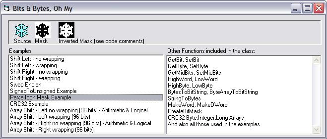



## FYI:  Bits \- Manipulation

### Description

The attached class contains a lot of bit manipulation routines. Here are some of them 1) Right/Left shifting, both logical &amp; arithmetic logic, both truncation &amp; wrapping, 2) Get/Set any bits or a range of bits, 3) Convert data types and byte arrays to a string of bits, 4) Convert a string of bits to byte,int,long 5) CRC32 calcs on arrays and strings, 6) and many more. Let me know if you see any errors or potential improvements.
 
### More Info
 

             |
---                |---
**Submitted On**   |2008-11-02 19:30:54
**By**             |[LaVolpe](https://github.com/Planet-Source-Code/PSCIndex/blob/master/ByAuthor/lavolpe.md)
**Level**          |Intermediate
**User Rating**    |4.9 (89 globes from 18 users)
**Compatibility**  |VB 6\.0
**Category**       |[VB function enhancement](https://github.com/Planet-Source-Code/PSCIndex/blob/master/ByCategory/vb-function-enhancement__1-25.md)
**World**          |[Visual Basic](https://github.com/Planet-Source-Code/PSCIndex/blob/master/ByWorld/visual-basic.md)
**Archive File**   |[FYI\_\_\_Bits2132981122008\.zip](https://github.com/Planet-Source-Code/lavolpe-fyi-bits-manipulation__1-71351/archive/master.zip)

